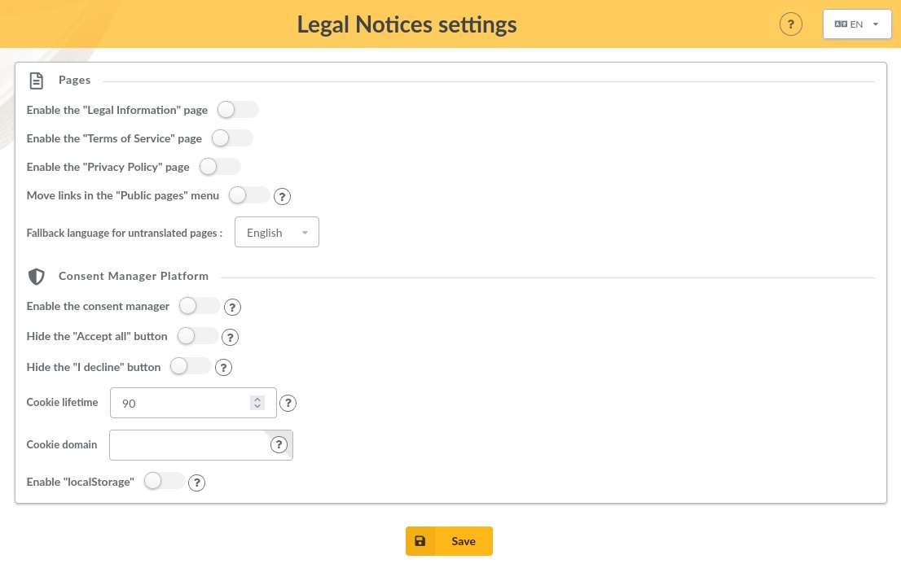
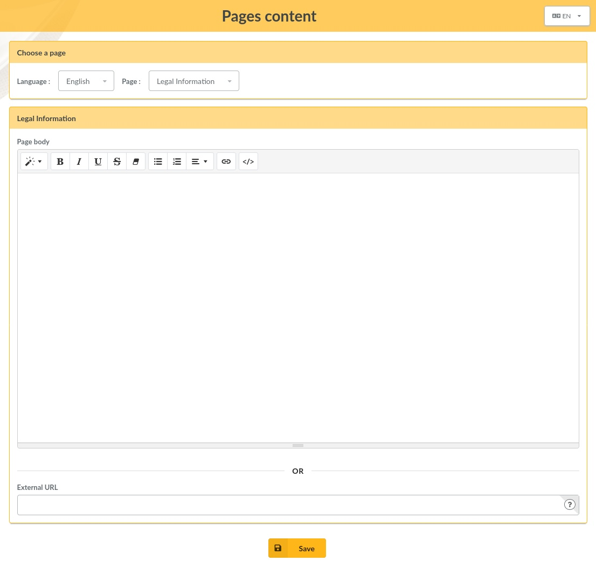

This plugin provides:

* up to 3 pages to write down legal notices :
  - Legal Information (for all common legal notices)
  - Terms of Service (in case you need to provide such terms)
  - Privacy Policy (for all notices regarding personal data processing and the use of cookies)
* a Consent Management Platform (for advanced users)

**Note**: this plugin requires Galette 1.2.0 or later.

## Installation

First of all, download the plugin:

[](https://github.com/gagnieray/plugin-legalnotices/releases/tag/1.0.0-rc1)

Extract the downloaded archive into Galette `plugins` directory. For example, on linux (replacing *{url}* and *{version}* with correct values):

```
$ cd /var/www/html/galette/plugins
$ wget {url}
$ tar xjvf galette-plugin-legalnotices-{version}.tar.bz2
```

## Database initialisation

In order to work, this plugin requires several tables in the database. See the [Galette plugins management interface](https://doc.galette.eu/en/master/plugins/index.html#plugins-managment).

And that’s it; the Legal Notices plugin is installed. :)

## Plugin usage

When the plugin is installed, a Legal Notices group is added to the Galette menu when a user is logged in, allowing administrators and staff members to define the settings of the plugin and edit the content of the pages.

### Settings



Several settings allow to change the plugin's behavior:

* **Enable de "Legal Information" page**
* **Enable de "Terms of Service" page**
* **Enable de "Privacy Policy" page**
* **Move links in the "Public pages" menu** : links are added by default in the footer. Enable this option if you want to move them in the "Public pages" menu.
* **Fallback language for untranslated pages**
* **Enable the consent manager**
* **Hide the "Accept all" button** : do not enable this option if you need to comply with the european legislation (GDPR & ePrivacy).
* **Hide the "I decline" button** :do not enable this option if you need to comply with the european legislation (GDPR & ePrivacy).
* **Cookie lifetime** : specify the maximum lifetime of the cookie used to store consent information in the browser (in days). After this period, the user's consent will be requested again.
* **Cookie domain** : use this if you want to get consent once for multiple matching domains. This supposes you are using Klaro! too on the other domains. By default, the current domain is used.
* **Enable "localStorage"** : by default, consent information is stored in the browser with a cookie. Enable this option if you want to use "locaStorage" instead. If enabled, setting the options above related to the cookie becomes irrelevant.

### Pages content



The content of each **page** can be edited in every available **language**.

It is possible to edit the **page body** using the WYSIWYG editor.

It is also possible to define an **external URL** when such a page already exists (on the association's website, for example). If it is defined, editing of the page body will be disabled, and users will be redirected to this link.

If both fields remain empty, the content of the *fallback language* chosen in the settings will be displayed to the users.

### About the Consent Manager Platform

**Note**: using the Consent Management Plateform (CMP) requires that you understand and know how to write JavaScript code.

Enabling the CMP in the settings does nothing useful on its own. By default, it will only display a message about the functional cookies stored by Galette. It will also add a link in the footer to open the Consent Manager after consent has already been received.

Thus, the CMP is only useful when you add additional external services for which user consent is required to enable them in Galette, such as an analytics service.

### How to add an external service ?

**Note**: this plugin uses [Klaro!](https://github.com/klaro-org/klaro-js) as its Consent Management Platform (CMP). The following code examples describe how to add a simple additional service. Please, read [Klaro! documentation](https://klaro.org/docs/) for further details and a better understanding.

1. First, you have to create a custom template file named `local_klaro_config.html.twig` in the `templates/default` folder of the plugin.

2. Then, you need to add the service in the CMP. Use the following code in your custom template file (adjust it to your needs ; you can find more details in the documentation of the CMP ; please read the [Annotated Config File](https://klaro.org/docs/integration/annotated-configuration)):

   ```
   <script type="text/javascript">
       let matomo = {
           name: 'matomo',
           purposes: ['analytics'],
           translations: {
               zz: {
                   title: 'Matomo'
               }
           }
       };
       klaroConfig.services.push(matomo);
   </script>
   ```

   The plugin provides several predefined `purposes` to organize addtional services in the Consent Manager :

   * `functional` (services in this category are mandatory and cannot be declined by the user)
   * `performance`
   * `analytics`
   * `marketing`
   * `advertising`

3. Finally, you need to add in your custom template file the actual code provided by the service, *but with minor changes* to the attributes of the `script` tag (for more explanations, read the second part of the [Getting Started](https://klaro.org/docs/getting-started) chapter in the documentation of the CMP) :

   ```
   <script type="text/plain" data-type="application/javascript" data-src="https://YOUR_MATOMO_URL" data-name="matomo"></script>
   ```
